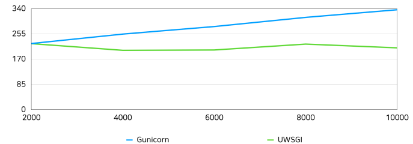

# Gunicorn vs UWSGI

## 환경

| 서버 사양 |                                                          |
| --------- | -------------------------------------------------------- |
| CPU       | Quad-Core Intel Core i7 (Core: 4, Thread: 8(HT), 2.2GHz) |
| Memory    | 16 GB                                                    |

---

| 모듈 버전 |        |
| --------- | ------ |
| Gunicorn  | 20.0.4 |
| UWSGI     | 2.0.18 |

## 측정 요소

- CPU 사용량

  - 마스터 프로세스와 워커 프로세스의 전체 CPU 사용량의 평균값

- 속도(latency)

  - 첫 요청의 시작 시간부터 마지막 요청의 응답이 도착한 시간의 차이를 측정

- 메모리(RAM) 사용량

  - 마스터 프로세스와 워커 프로세스 전체 RSS의 평균값

- 오류

  - 오류 발생 횟수

- 1회 측정 후 서버 프로세스를 재시작
- 요소별로 5회씩 측정 후 평균값으로 차트 생성

## CPU 사용량(%)

| Connections | Gunicorn | UWSGI  |
| ----------- | -------- | ------ |
| 2000        | 0.0086   | 0.001  |
| 4000        | 0.0182   | 0.0006 |
| 6000        | 0.0108   | 0.0004 |
| 8000        | 0.01019  | 0.0024 |
| 10000       | 0.0098   | 0.0006 |

## 속도(latency)

| Connections | Gunicorn | UWSGI  |
| ----------- | -------- | ------ |
| 2000        | 2.7      | 1.871  |
| 4000        | 6.36     | 4.178  |
| 6000        | 11.62    | 6.942  |
| 8000        | 16.38    | 26.176 |
| 10000       | 25.4     | 49.848 |

## 메모리(RAM) 사용량(MB)

| Connections | Gunicorn | UWSGI   |
| ----------- | -------- | ------- |
| 2000        | 222.72   | 222.356 |
| 4000        | 254.61   | 199.83  |
| 6000        | 279.97   | 201.01  |
| 8000        | 310.86   | 220.85  |
| 10000       | 336.53   | 208.18  |

## 에러(Errors)

| Connections | Gunicorn | UWSGI  |
| ----------- | -------- | ------ |
| 2000        | 0        | 0      |
| 4000        | 0        | 0      |
| 6000        | 0        | 12     |
| 8000        | 0        | 1254   |
| 10000       | 366.4    | 5159.4 |
